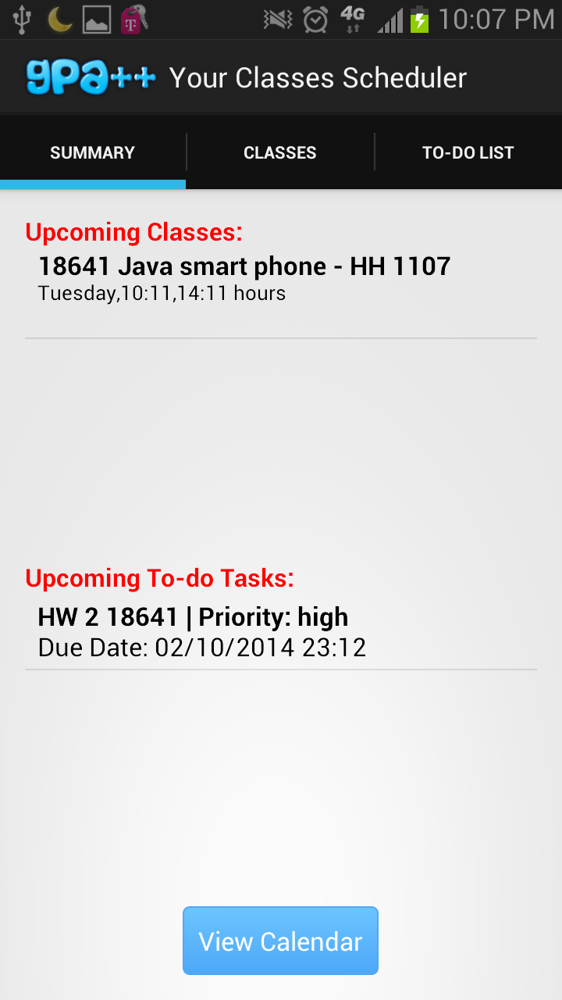
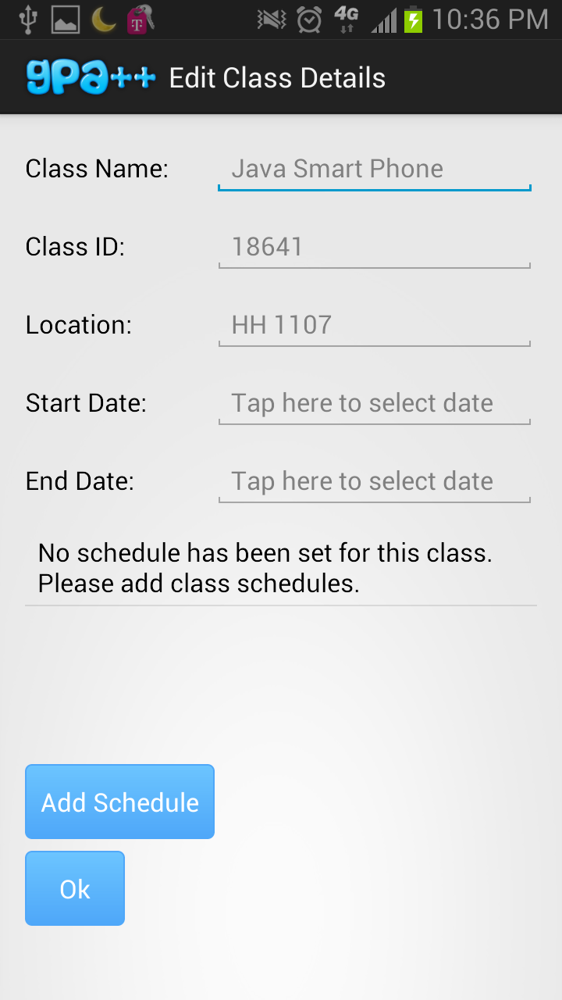
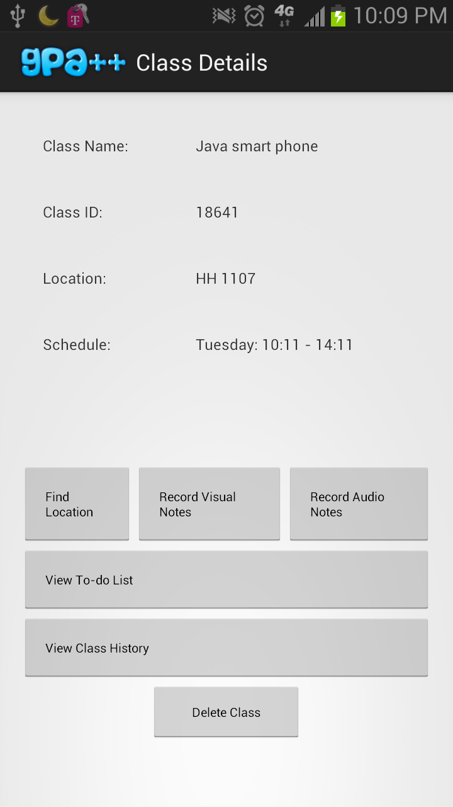
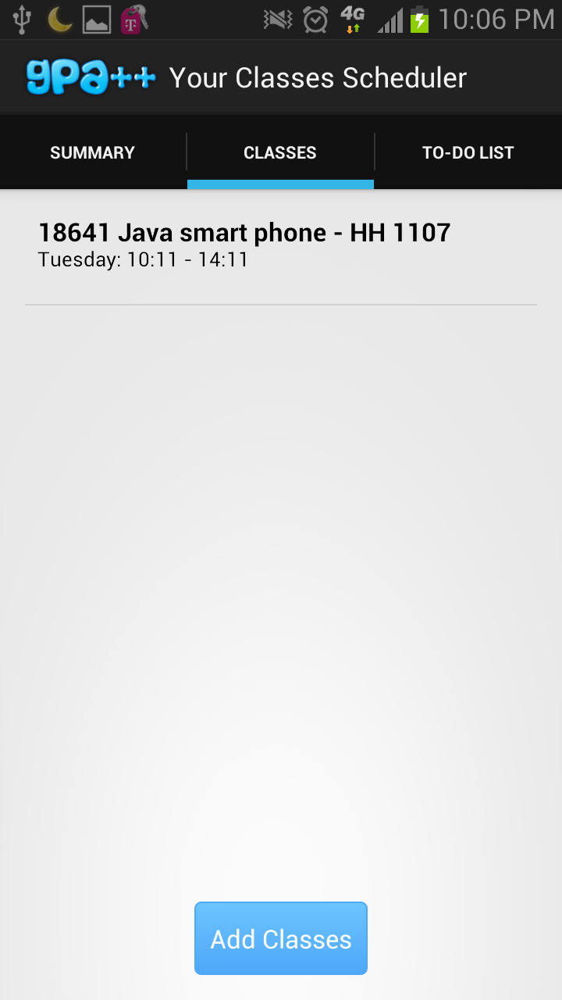
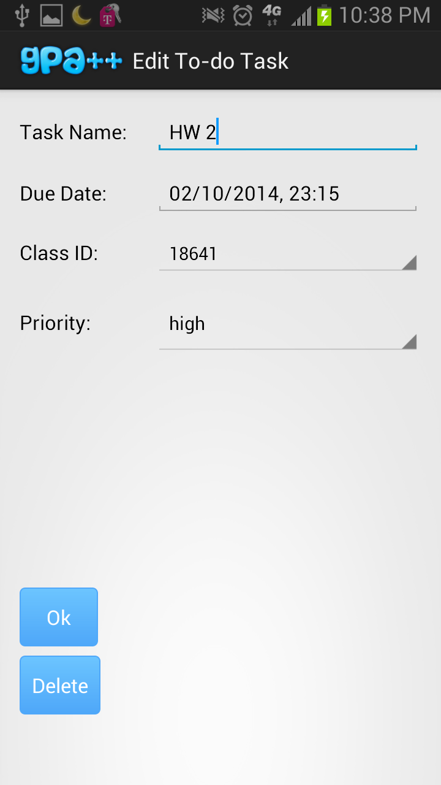

AndroidApp
==========

This repository contains the source code for Android Apps

1. No classes and task

2. Classes and tasks filled in

3. Edit class activity

4. Class detail activity

5. Class fragment

6. Edit To-do Task
