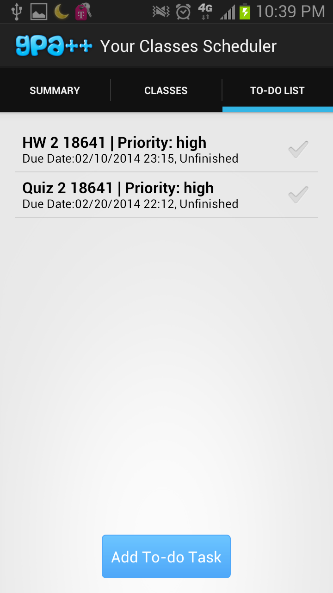
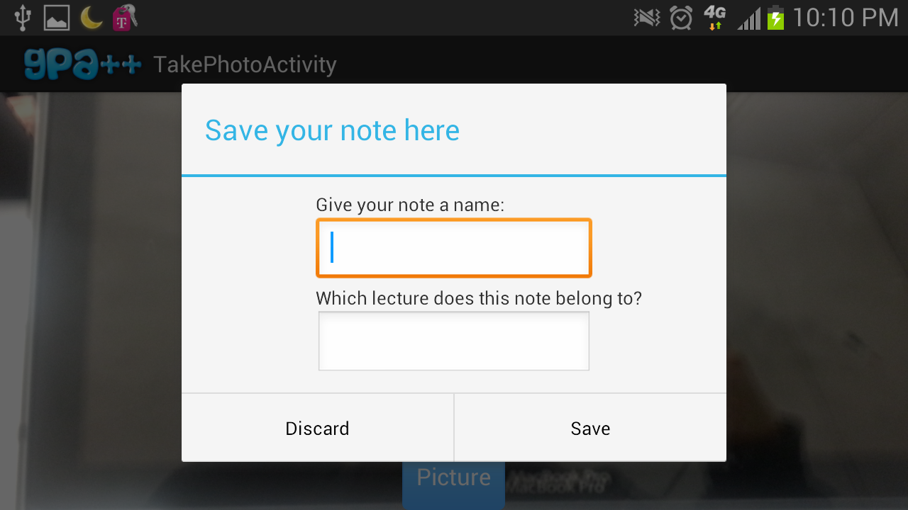
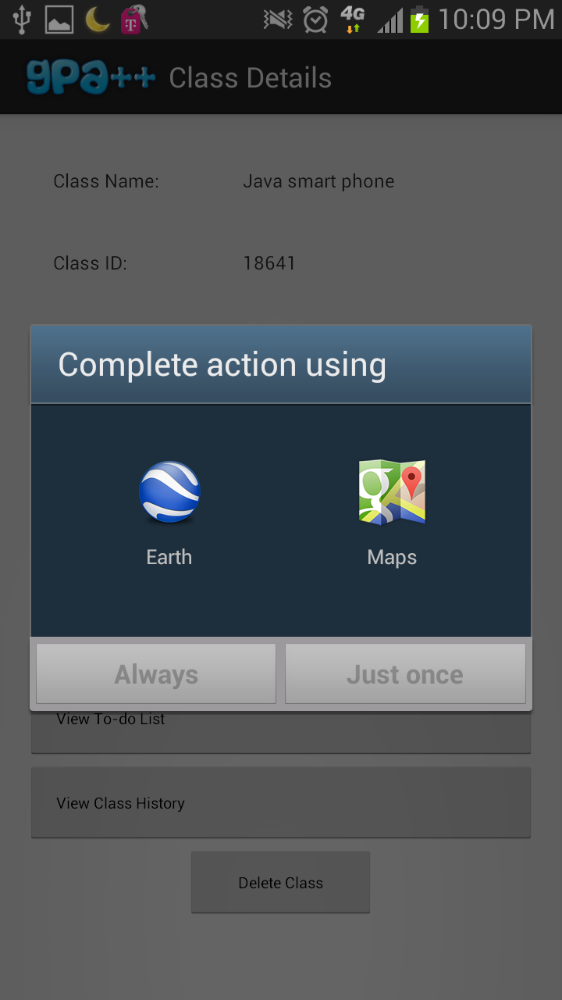
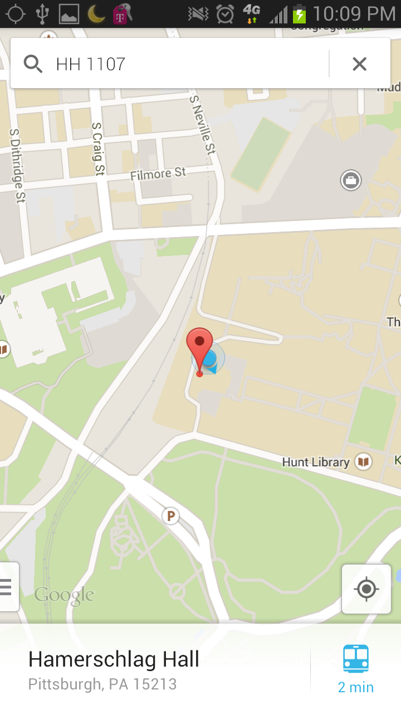
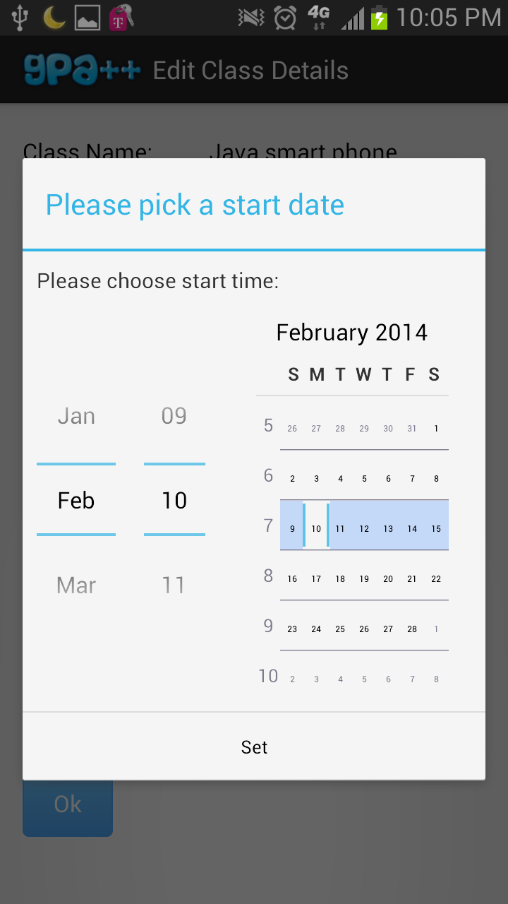
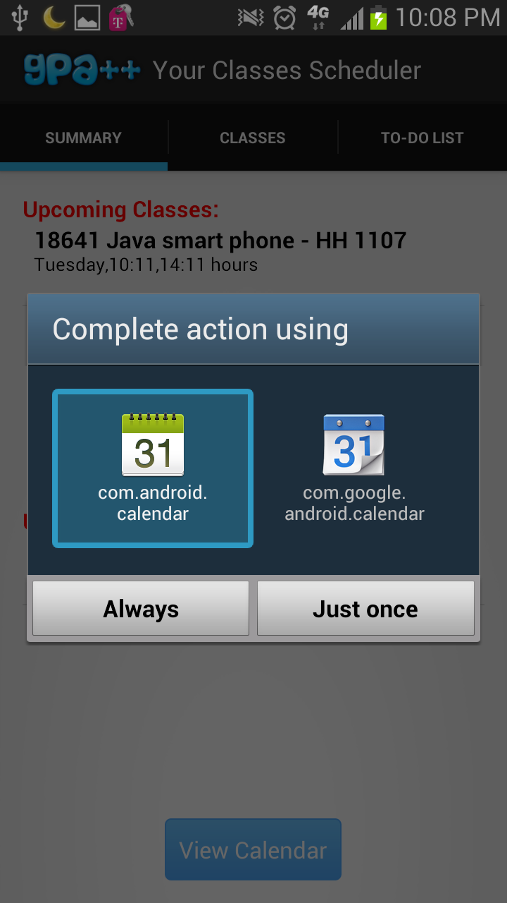
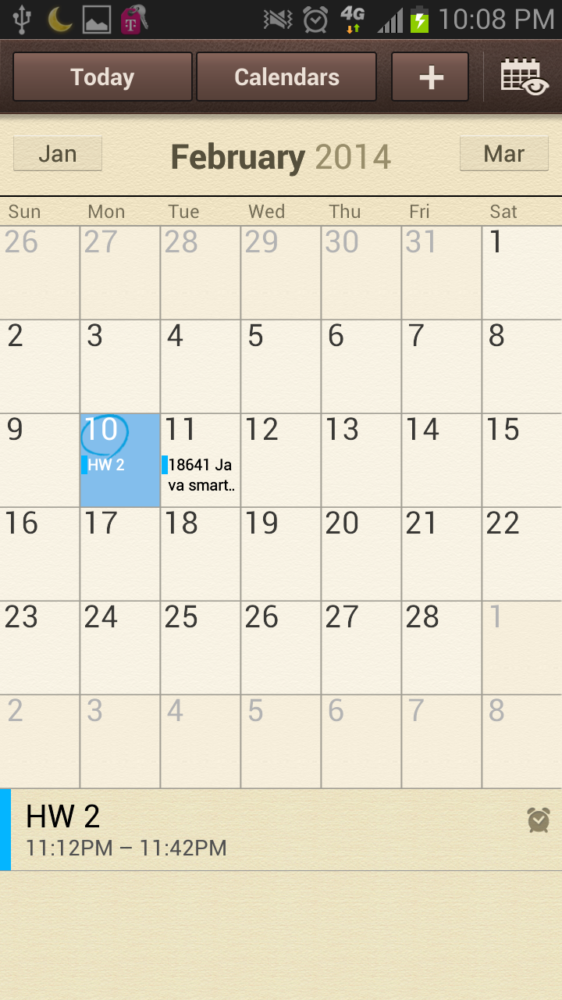
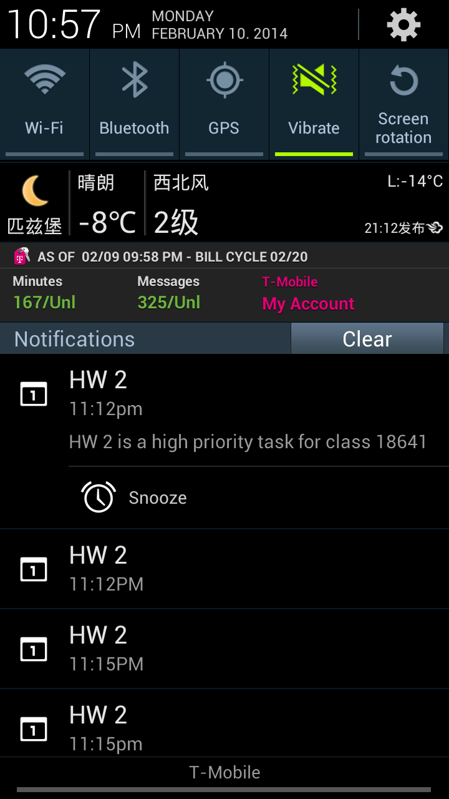

GPA++ Scheduler App
==========

This repository contains the source code for Android Apps

Product Name: GPA++

Product Description:

GPA++ is aimed to help student keep his or her school life organized. Have you ever got lost on campus when trying to find a classroom? Forgot a deadline for an important homework? Want to record diagrams or lists on white board? Want to review the tasks you’ve finished? Need to record video or voice for an event but don’t want to sort a bunch of them afterward? GPA++ can help students solve all these problems with just a few touches.
GPA++ provides a helpful solution for those problems. It has the following features aimed towards easing the academic student life to help you achieve that A+!  

● Add classes to keep track of them   

● Add a prioritized to­do list for all your upcoming meetings, exams, homeworks,
assignments and projects   

● Notify students the class times and to­do task deadlines   

● Find a classroom in the built­in map   

● Record audio and video notes during classes using the microphone or the video camera   

● Jot down blackboard lecture notes using the camera    

● Review previously recorded notes within the app    

Android Features Used:

GPA++ is a standalone Android app that let's users store various information on their academic classes and uses the following Android features:   

● Hardware Audio (review audio lecture notes)   

● Camera (record visual lecture notes)  

● Location (find classrooms)   

● Network­based Geo location (find classrooms)   

● GPS (find classrooms)   

● Microphone (record audio lecture notes)   

● Compass sensor (find classrooms)   

● Touchscreen (browse the app)   

● Multi­touch Screen (zoom in and out of map for finding classrooms)   

● SQL Lite DB (store classes and to­do tasks information)      

1. No classes and task

2. Classes and tasks filled in

3. Edit class activity

4. Class detail activity

5. Class fragment

6. Edit To-do Task

7. Task fragment overview

8. Take image and store 

9. Find location using google map

10. Set class date using date picker dialogue 

11. View all info in calendar

12. Reminder shows before deadline
